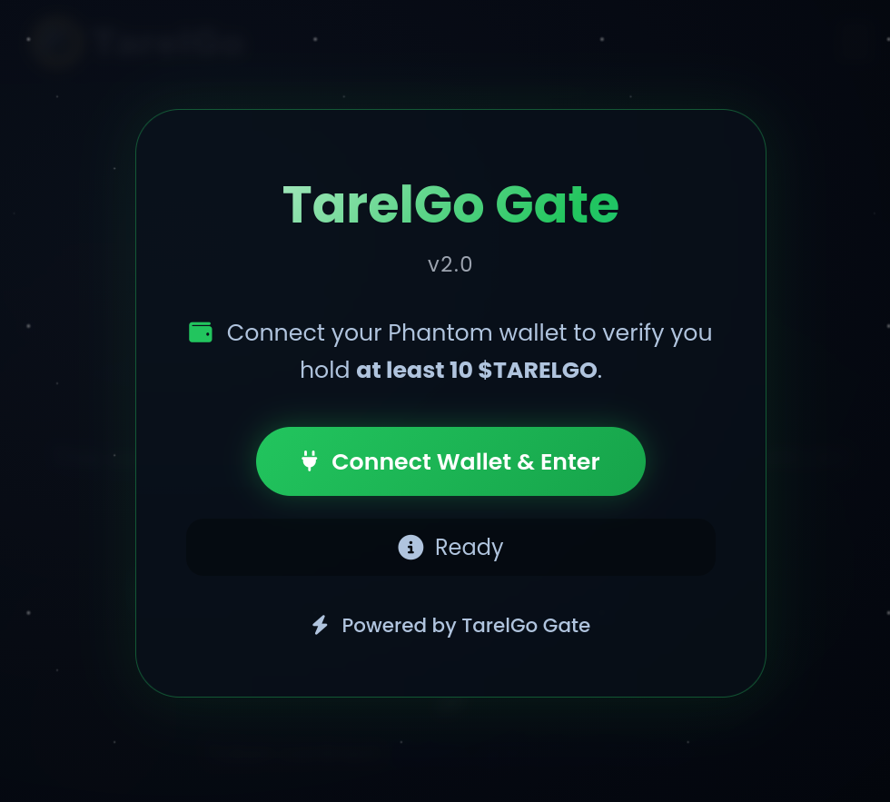
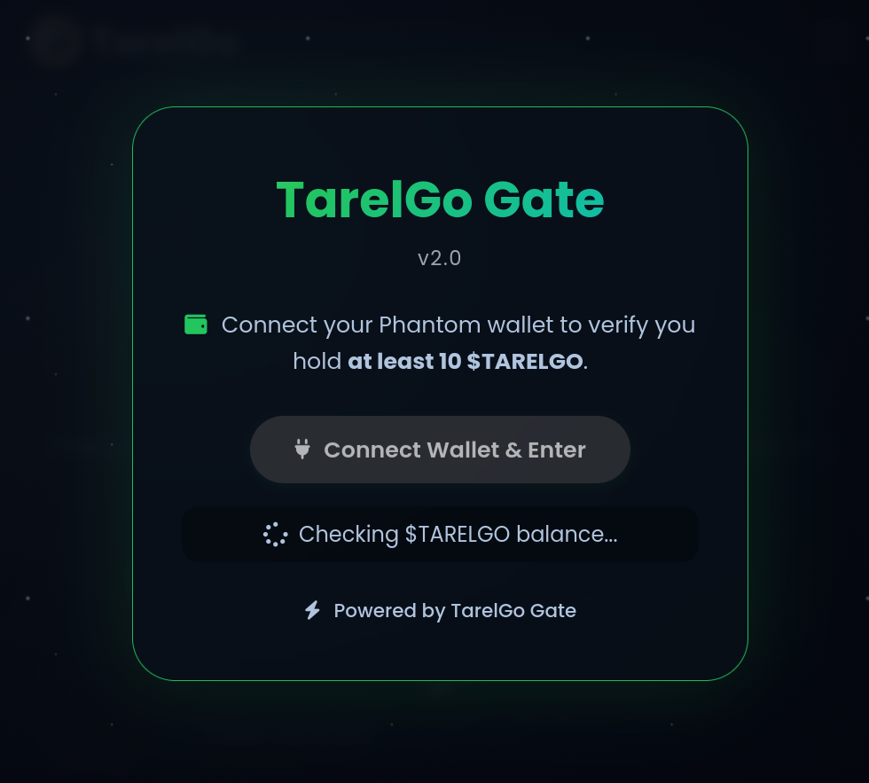
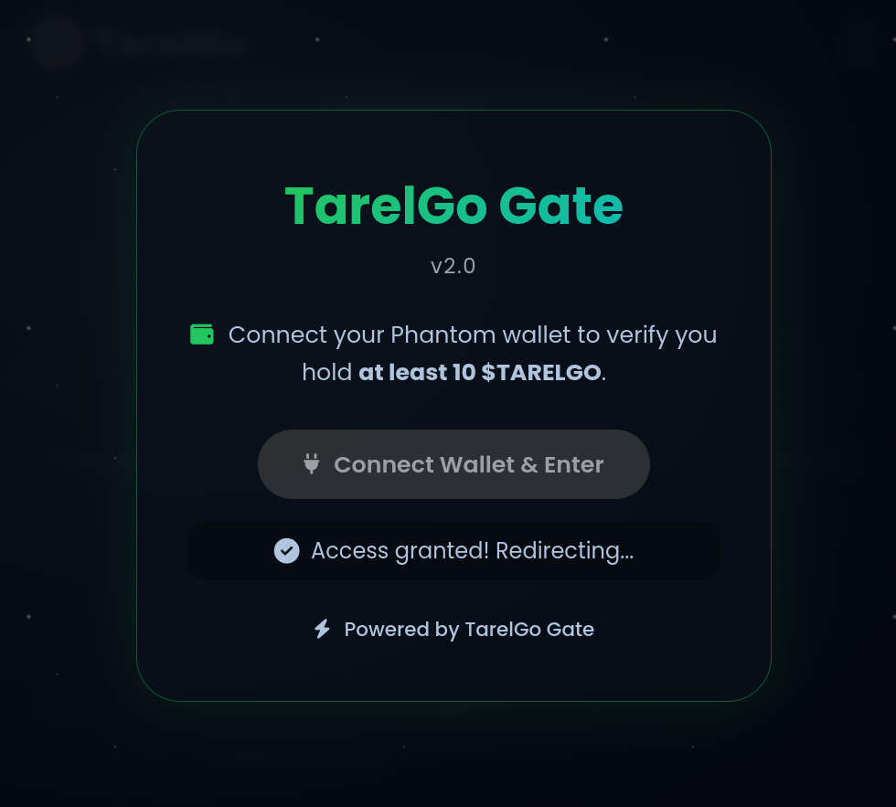

# TarelGo Gate

**Token‑gated access for the TarelGo ecosystem.**  
Verify your $TARELGO balance and unlock exclusive content based on how many tokens you hold.

---

## 🌐 Live Demos

| Version | Link | Description |
|---------|------|-------------|
| **v1.0** (stable) | [tarelgo.com/gate.html](https://tarelgo.com/gate.html) | One‑time balance check → redirect to a secret URL |
| **v2.0** (current) | [tarelgo.com/gate-test.html](https://tarelgo.com/gate-test.html) | JWT‑protected pages, time‑limited access, manual tier selection |

A Phantom wallet with $TARELGO tokens is required.

## 📸 Screenshots

| Step 1: Start | Step 2: Verify | Step 3: Access |
|---------------|----------------|----------------|
|  |  |  |

---

## ✨ Features

Both versions offer **three access tiers** based on the amount of $TARELGO you hold:

| Tier | Minimum $TARELGO | Protected URL |
|------|------------------|---------------|
| 🥉 **Level 1** | 10 | `https://tarelgo.com/SECRET_URL1/...` |
| 🥈 **Level 2** | 100 | `https://tarelgo.com/SECRET_URL2/...` |
| 🥇 **Level 3** | 1000 | `https://tarelgo.com/SECRET_URL3/...` |

The gate **automatically** selects the highest tier you qualify for.

---

## 🚀 Version Differences

### v1.0 – Simple Redirect
- Connect Phantom wallet
- Balance is checked **once**
- You receive a **permanent redirect** to the appropriate secret URL
- **No further protection** – the URL can be shared or bookmarked after the first visit
- Ideal for quick, low‑security use cases

### v2.0 – JWT‑Secured Access (Current)
- Connect Phantom wallet (or use **manual tier selection** for demo purposes)
- A **short‑lived JWT token** is issued after successful verification
- Protected pages **cannot be opened without a valid token**
- Token is stored in a **secure HTTP‑only cookie** and expires automatically
- Unauthorised requests are **redirected back to the gate**
- Perfect for production environments where content must remain private

---

## 🔧 Custom Token Support

TarelGo Gate is built to be **token‑agnostic**. Although the default implementation uses the Tarelgo token, **any SPL token on Solana** can be used as a gate key – just change the mint address and thresholds in the configuration.  
This makes TarelGo Gate suitable for a wide range of token‑gated use cases beyond the Tarelgo ecosystem.

---

## 🔒 Security

- All access decisions happen **server‑side**
- Protected URLs are **never exposed** to the client until authorised
- JWT tokens are **short‑lived** (5 minutes by default)
- Token cookie is set with `Secure` and `SameSite=Strict` flags
- No sensitive data is stored in the browser

---

## 🧭 Roadmap

**TarelGo Gate** is under active development. The next major milestone is **TarelGo Gate AI** – a dedicated OAuth 2.0 integration for Discourse forums, bringing seamless single sign‑on with token‑gated logic.

**Wallet support** is also expanding:

- ✅ Phantom  
- 🔜 Solflare  
- 🔜 Backpack  

More wallets and deeper integrations are planned.

---

## 📦 Repository

This public repository contains **release snapshots and documentation**.  
The full source code is maintained in a private repository.

- `README.md` – you are here
- `CHANGELOG.md` – version history
- `LICENSE` – MIT

Tags:
- `v1.0.0` – first stable release (simple redirect)
- `v2.0.0` – JWT‑protected access + demo mode

---

## 🛠️ Built with

- [Solana](https://solana.com) – blockchain
- [Phantom](https://phantom.app) – wallet integration (more coming soon)
- FastAPI, Nginx, vanilla JavaScript

---

## 📄 License

MIT – see [LICENSE](LICENSE) for details.

---

*Powered by [TarelGo](https://tarelgo.com)*
